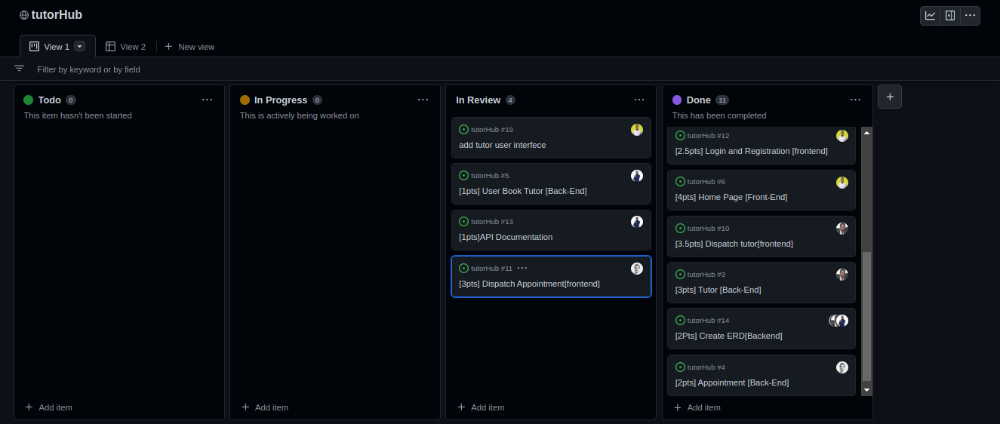
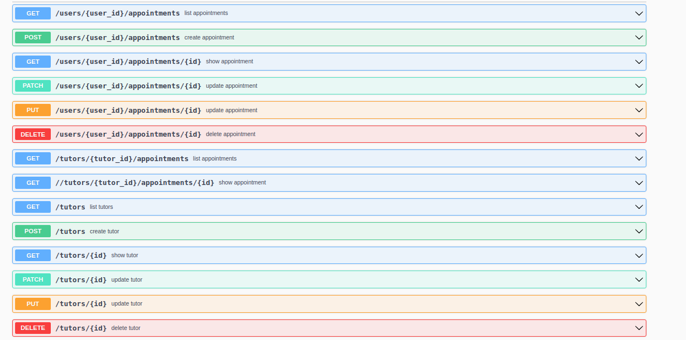
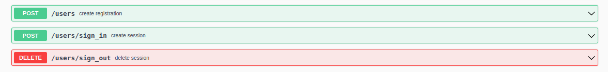

<a name="readme-top"></a>
# 📗 Table of Contents

- [📖 About the Project](#about-project)
  - [🛠 Built With](#built-with)
    - [Tech Stack](#tech-stack)
    - [Key Features](#key-features)
  - [Website Mockup](#screenshots)
  - [Kanban Board](#kanban-board)
  - [React Frontend](#react-frontend)
  - [API Documentation](#api-docs)
  - [🚀 Live Demo](#live-demo)
  
- [💻 Getting Started](#getting-started)
  - [Setup](#setup)
  - [Prerequisites](#prerequisites)
  - [Install](#install)
  - [Usage](#usage)
  - [Run tests](#run-tests)
  - [Deployment](#triangular_flag_on_post-deployment)
- [👥 Authors](#authors)
- [🔭 Future Features](#future-features)
- [🤝 Contributing](#contributing)
- [⭐️ Show your support](#support)
- [🙏 Acknowledgements](#acknowledgements)
- [📝 License](#license)

<!-- PROJECT DESCRIPTION -->

# 📖 ExpertHub [Fontend] <a name="about-project"></a>
ExpertHub is a tutor reservasation website that provide the public with an easy and convenient way to rent tutor and offer teaching services to people.

- [Backend](https://github.com/Bateyjosue/tutorHub)<a name="rails-backend"></a>
- [Kanban Board](https://github.com/users/Bateyjosue/projects/4/views/1)<a name="kanban-board"></a>


## 🛠 Built With <a name="built-with"></a>

### Tech Stack <a name="tech-stack"></a>

<details>
  <summary>Client</summary>
  <ul>
    <li><a href="https://reactjs.org/">React.js</a></li>
  </ul>
</details>

<details>
  <summary>Server</summary>
  <ul>
    <li>Rails</li>
  </ul>
</details>

<details>
<summary>Database</summary>
  <ul>
    <li><a href="https://www.postgresql.org/">PostgreSQL</a></li>
  </ul>
</details>

<!-- Features -->

### Key Features <a name="key-features"></a>

- **tutors endpoint**
- **Users can add/remove a tutor**
- **Users can book a tutor**

## 💻 Website Mockup <a name="screenshots"></a>

<!-- ## Entity Relationship Diagram <a name="er-diagram"></a>
 -->

<!-- Kanban Board -->
<!-- API Docs -->
<!-- ER DIAGRAM-->

## 🚀 Live Demo <a name="live-demo"></a>

- [Live Demo]()

## [API Documentation](https://experthub-production.up.railway.app/api-docs/index.html) <a name="api-documentation"></a>


 


<p align="right">(<a href="#readme-top">back to top</a>)</p>

<!-- GETTING STARTED -->
## 💻 Getting Started <a name="getting-started"></a>

To get a local copy up and running, follow these steps.
### Prerequisites

Make sure you have `Git` and `Ruby` installed
```
 gem install rails
```

### Install

Install the project using this command:


### db Commands

`rails db:create`
`rails db:migrate`
`rails db:seed`

### To generate master.key and config/credentials.yml.enc

Run in terminal:

EDITOR=code rails credentials:edit

This command will create a new master.key and credentials.yml.enc if they do not exist.

```
  bundle install
```

### Usage

Run project using this command:

```
rails s
```

Run tests using this command:
```
rake rswag
```

<p align="right">(<a href="#readme-top">back to top</a>)</p>

<!-- AUTHORS -->

## 👥 Authors <a name="authors"></a>
👤 **Brian Tom**
- GitHub: [Bree]()
- Twitter: [Bree]()
- LinkedIn: [Bree]()

👤 **Kene Agagwu**

- GitHub: [kenny]()
- LinkedIn: [kenny]()

👤 **Josh Batey**

- GitHub: [@Bateyjosue](https://github.com/Bateyjosue)
- Twitter: [@Bateyjosue](https://twitter.com/Bateyjosue)
- LinkedIn: [Josh](https://www.linkedin.com/in/josue-ishara/)

👤 **Bakhtiyor**

- GitHub: [Bakhtiyor]()
- LinkedIn: [Bakhtiyor]()
<p align="right">(<a href="#readme-top">back to top</a>)</p>

<!-- FUTURE FEATURES -->

## 🔭 Future Features <a name="future-features"></a>

- [ ] **Rspec tests**

<!-- CONTRIBUTING -->

## 🤝 Contributing <a name="contributing"></a>

Contributions, issues, and feature requests are welcome!
Feel free to check the [issues page]().

<!-- SUPPORT -->

## ⭐️ Show your support <a name="support"></a>

Give a ⭐️ if you like this project!

<!-- ACKNOWLEDGEMENTS -->

## 🙏 Acknowledgments <a name="acknowledgements"></a>

- [Microverse](https://www.microverse.org/)

<!-- LICENSE -->

## 📝 License <a name="license"></a>

This project is [MIT](./MIT.md) licensed.

<p align="right">(<a href="#readme-top">back to top</a>)</p>
